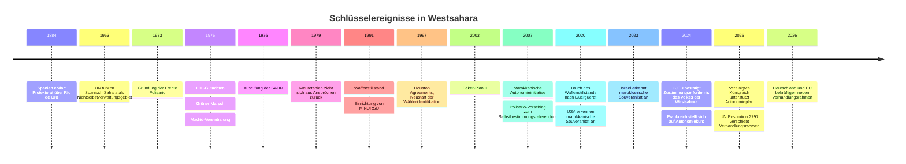
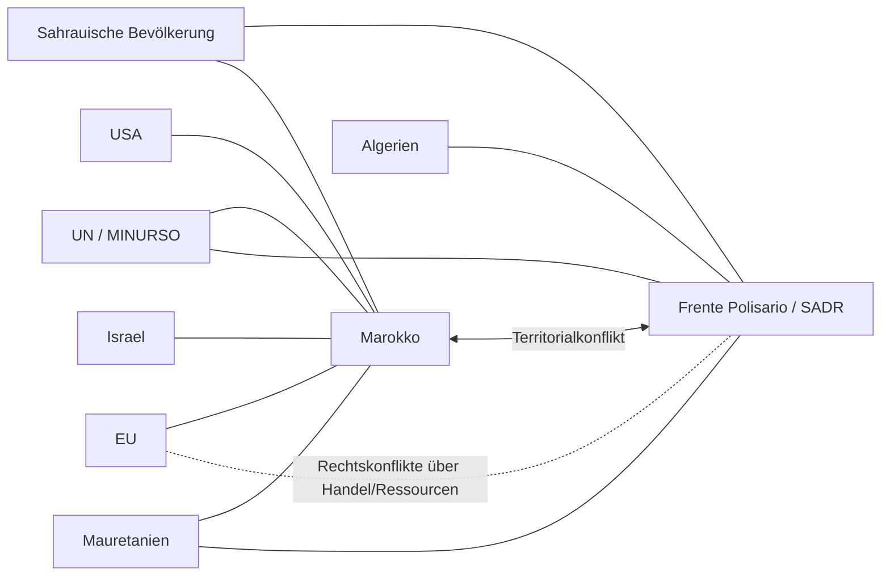

> **INTERNAL RESEARCH DRAFT — NOT PUBLIC**
> This file contains raw AI-assisted research with citation artifacts (`citeturn...`, `iturn...`).
> Do not serve, link, or publish this file. The public-facing article is `westsahara.html`.

---

# Westsahara zwischen Dekolonisierung, Krieg und geopolitischer Verschiebung

iturn47image1

Zur geografischen Orientierung sind amtliche Karten der UN Geospatial Section, MINURSO-Deploymentskarten und der UNHCR-Atlas besonders nützlich. Diese Karten zeigen auch den marokkanischen Berm, die wichtigsten Städte sowie die Lage der Flüchtlingslager bei Tindouf. citeturn33search1turn33search4turn33search9

## Zusammenfassung

Westsahara ist völkerrechtlich weiterhin ein **Nichtselbstverwaltungsgebiet** der Vereinten Nationen. Die UN führen das Gebiet seit 1963 auf ihrer Liste der zu entkolonialisierenden Territorien. Zugleich kontrolliert Marokko de facto den bevölkerungsreicheren und wirtschaftlich wichtigsten Teil des Territoriums westlich des Berms, während die Frente Polisario östliche und südliche Gebiete beansprucht und von Flüchtlingslagern bei Tindouf in Algerien aus politisch und militärisch operiert. Der Kernkonflikt ist daher kein „gewöhnlicher Grenzstreit“, sondern ein bis heute ungelöster Dekolonisierungsfall, in dem sich Selbstbestimmungsrecht, Territorialansprüche, Ressourcenpolitik und regionale Machtkonkurrenz überlagern. citeturn44search0turn25view0turn22search4turn41news33

Die stärksten juristischen Fixpunkte bleiben das Gutachten des Internationalen Gerichtshofs von 1975 und die spätere Rechtsprechung des Gerichtshofs der Europäischen Union. Der IGH stellte fest, dass zwar historische Rechtsbeziehungen einzelner Stämme zu Marokko und zur mauretanischen Einheit bestanden, diese aber **keine territoriale Souveränität** begründeten, die das Selbstbestimmungsrecht der Bevölkerung der Westsahara verdrängen könnte. Der EuGH/CJEU hat diese Logik in seiner Westsahara-Rechtsprechung fortgeführt und 2024 erneut bekräftigt, dass Abkommen der EU mit Marokko nicht auf Westsahara angewandt werden dürfen, wenn das **Volk der Westsahara** dem nicht zugestimmt hat. citeturn43view2turn25view5turn25view6turn11view5turn41news32

Politisch verschiebt sich die internationale Lage jedoch in eine andere Richtung. Seit der US‑Anerkennung marokkanischer Souveränitätsansprüche 2020 haben Israel, Frankreich, das Vereinigte Königreich und 2026 auch Deutschland beziehungsweise die EU in offiziellen Erklärungen die marokkanische Autonomieinitiative zunehmend als ernsthafte oder gar bevorzugte Grundlage eines künftigen Arrangements beschrieben. Die Resolution 2797 des Sicherheitsrats von 2025 markiert insofern einen Einschnitt, weil sie die marokkanische Autonomieinitiative ausdrücklich als Verhandlungsbasis hervorhebt und „genuine autonomy“ unter marokkanischer Souveränität als mögliches Ergebnis bezeichnet. Gleichzeitig bleibt die UN-Klassifikation des Gebiets als Nichtselbstverwaltungsgebiet bestehen; ein endgültiger Statuswechsel ist daraus **nicht** automatisch gefolgt. citeturn11view3turn12search8turn11view6turn11view7turn11view8turn24view3turn44search0turn44search1

Humanitär bleibt der Konflikt tiefgreifend. Die Sahraui‑Flüchtlingslager bei Tindouf beherbergen nach UN‑Angaben rund **173.600** Menschen in fünf Lagern. Sie sind in hohem Maße von externer Hilfe abhängig; WFP berichtet, dass 78 Prozent der Flüchtlinge ernährungsunsicher oder akut gefährdet sind, und mehr als die Hälfte der Frauen im gebärfähigen Alter an Anämie leidet. Parallel werfen Amnesty International, Human Rights Watch und UN‑Menschenrechtsexpert:innen marokkanischen Behörden in den von Marokko kontrollierten Teilen Westsaharas Repression gegen Aktivist:innen, Überwachung, willkürliche Strafverfolgung und Einschränkungen von Meinungs‑ und Vereinigungsfreiheit vor. Für die Tindouf‑Lager existieren ebenfalls Vorwürfe zu Freiheitsbeschränkungen und Mängeln bei Rechtsgarantien, doch ist die aktuelle unabhängige Evidenzlage dort dünner und der fehlende individuelle Registrierungsstand erschwert belastbare demografische und rechtsstaatliche Bewertungen zusätzlich. citeturn19view8turn24view4turn13search9turn13search14turn14search13turn13search11

Analytisch ist Westsahara heute weniger durch einen einzigen „eingefrorenen“ Konflikt zu beschreiben als durch ein **Konfliktsystem**: ungelöste Dekolonisierung, begrenzte Kampfhandlungen seit 2020, Ressourcennutzung ohne konsensbasierte Statuslösung, marokkanisch‑algerische Rivalität, EU‑Interessen an Handel, Migration und Sicherheit sowie eine hoch verdichtete Schlacht um Narrative, Karten, Begriffe und internationale Sichtbarkeit. Gerade deshalb sind einfache Etiketten irreführend: Wer nur von „territorialer Integrität“ spricht, blendet das Dekolonisierungsrecht aus; wer nur von „letzter Kolonie Afrikas“ spricht, unterschätzt die veränderte diplomatische Realität seit 2020. citeturn44search0turn43view2turn24view3turn11view8turn46search7turn46search10

## Geschichte und Konfliktentstehung

Vor der spanischen Kolonisierung war der Raum Westsahara kein moderner Territorialstaat, sondern von **hassanischsprachigen**, überwiegend nomadischen oder halbnomadischen Stammesgesellschaften geprägt, die über weite Teile des westlichen Sahara‑Raums bis nach Mauretanien, Algerien und den Süden des heutigen Marokko vernetzt waren. Die neuere Anthropologie betont, dass sich eine moderne, politisch verdichtete **Sahraui‑Identität** erst im Widerstand gegen die Kolonialherrschaft des 20. Jahrhunderts in den 1960er und 1970er Jahren herausbildete, also später als viele heutige nationale Narrative suggerieren. citeturn35view0turn31search5turn27view2

Spanien erklärte 1884 zunächst ein Protektorat über Río de Oro; aus mehreren Verwaltungseinheiten entstand später die spanische Kolonie beziehungsweise Provinz **Spanisch‑Sahara**. 1963 wurde das Gebiet von den Vereinten Nationen in die Liste der Nichtselbstverwaltungsgebiete aufgenommen. In den späten Kolonialjahren radikalisierte sich die antikoloniale Mobilisierung; 1973 gründete sich die **Frente Polisario**. 1975 beschleunigten der „Grüne Marsch“ Marokkos, die Krise des Franco‑Regimes in Spanien und der internationale Druck den spanischen Rückzug. citeturn32search20turn44search0turn27view4turn27view1

Die sogenannte **Madrid‑Vereinbarung** vom November 1975 beendete die spanische Präsenz politisch, löste den völkerrechtlichen Status des Gebiets aber nicht. In der Folge besetzten Marokko und Mauretanien verschiedene Teile der Westsahara; die Polisario rief 1976 die **Sahrauische Arabische Demokratische Republik** aus. 1979 zog sich Mauretanien aus seinen Ansprüchen zurück; seither verwaltet Marokko das Gebiet praktisch allein in den von ihm kontrollierten Zonen, ohne von der UN als Verwaltungsmacht geführt zu werden. Daraus erklärt sich der bis heute fortdauernde juristische und politische Schwebezustand. citeturn45search0turn31search9turn10search0turn27view6

Die folgende Zeitleiste verdichtet die historisch wichtigsten Wegmarken von der spanischen Kolonisierung bis zur gegenwärtigen diplomatischen Verschiebung. Sie basiert auf UN‑Dokumenten, dem IGH‑Gutachten, Bundestagsgutachten, MINURSO‑Materialien und neueren Regierungs‑ bzw. Gerichtsquellen. citeturn44search0turn43view2turn10search6turn25view0turn11view5turn11view6turn11view7turn11view8

## Völkerrecht, UN-Prozess und Referendumsfrage

Völkerrechtlich ist Westsahara bis heute **kein anerkannter Teil Marokkos**. Das zentrale juristische Dokument bleibt das Gutachten des Internationalen Gerichtshofs vom 16. Oktober 1975. Der Gerichtshof stellte fest, dass die ihm vorgelegten Materialien **keine territoriale Souveränität** Marokkos oder der mauretanischen Einheit über Westsahara belegten und keine Rechtsbeziehungen von solcher Art gefunden wurden, die die Anwendung der UN‑Dekolonisationsresolution 1514 (XV) und insbesondere das Selbstbestimmungsrecht der Bevölkerung der Westsahara durch freie Willensäußerung beeinträchtigen könnten. Genau diese Passage ist bis heute der Angelpunkt fast aller juristischen Debatten über Status, Referendum und Ressourcen. citeturn43view2turn43view1

Ebenso wichtig ist, was die **Madrid‑Vereinbarung** rechtlich nicht leistete. Das UN‑Gutachten des damaligen UN‑Rechtsberaters Hans Corell von 2002 hält ausdrücklich fest, dass Marokko das Gebiet seit 1979 allein verwaltet, aber **nicht** als Verwaltungsmacht der UN geführt wird. In der juristischen Debatte wird daraus häufig der Schluss gezogen, dass Spanien seine Pflichten als frühere Verwaltungsmacht nicht wirksam auf andere Staaten übertragen konnte. Zugleich ist diese Frage nicht völlig frei von Kontroversen, weil die UN in neueren Dokumenten oft den fortdauernden nicht abgeschlossenen Dekolonisierungsstatus betonen, ohne Spanien operativ als aktuelle Verwaltungsmacht einzusetzen. Der rechtlich belastbarste Minimalbefund lautet daher: **Die Souveränität ist ungeklärt; die Dekolonisierung ist unvollendet; Marokko ist nicht die von der UN anerkannte Verwaltungsmacht.** citeturn45search0turn45search4turn27view6turn44search15

1991 wurde mit Resolution 690 **MINURSO** eingerichtet, ursprünglich mit dem Ziel, einen Waffenstillstand zu überwachen und ein Referendum über den Endstatus des Gebiets zu organisieren. MINURSO beschreibt ihre heutige Rolle selbst als Konfliktpräventionsmechanismus, der militärische Aktivitäten beobachtet, die Sicherheitssituation meldet, Mine‑Action unterstützt und das Büro des UN‑Sondergesandten logistisch flankiert. Dass die Mission trotz ihres Namens bis heute **kein Referendum** umgesetzt hat, ist Ausdruck nicht bloß technischer, sondern zutiefst politischer Blockaden. citeturn10search6turn25view0

Die Referendumsfrage scheiterte vor allem an der **Wähleridentifikation**. Die Houston Agreements von 1997 setzten den Identifikationsprozess zwar wieder in Gang, doch Streitpunkte über die Reichweite des spanischen Zensus von 1974, die Einbeziehung bestimmter Stammesgruppen, Repatriierungslisten und tausende Einsprüche ließen das Verfahren erneut entgleisen. Die Literatur beschreibt die Wählerfrage deshalb nicht als administratives Detail, sondern als eigentlichen Kern des politischen Konflikts: Wer als „Volk der Westsahara“ gilt, entscheidet über das Ergebnis eines potenziellen Referendums. citeturn18search16turn18search22turn18search17

Seit dem marokkanischen Vorgehen in **Guerguerat** im November 2020 und der anschließenden Erklärung der Polisario, der Waffenstillstand von 1991 sei beendet, spricht MINURSO offiziell wieder von einer wiederaufgenommenen Feindseligkeit und konzentriert sich stärker auf Deeskalation und Beobachtung als auf einen nahen Referendumsfahrplan. Die Resolution 2797 von 2025 und die daran anschließenden Erklärungen Deutschlands und der EU verschieben den UN‑Rahmen weiter: Die marokkanische Autonomieinitiative wird nun ausdrücklich als **Basis** von Verhandlungen genannt; zugleich bleibt formal der Bezug auf Selbstbestimmung erhalten. Genau daraus entsteht die heutige Grundspannung: Der UN‑Rahmen ist **nicht aufgehoben**, aber sein politisches Gewicht verschiebt sich vom offenen Statusreferendum hin zu einer verhandelten Autonomielösung unter marokkanischer Souveränität. citeturn39search2turn39search5turn25view0turn11view8turn24view3

## Akteure, Ressourcen und politische Ökonomie

Die Konfliktdynamik lässt sich nur verstehen, wenn man die Hauptakteure, ihre Rechtsnarrative und ihre materiellen Hebel nebeneinanderlegt.

| Akteur | Kernziel | Zentrale Hebel | Dominantes Narrativ | Belege |
|---|---|---|---|---|
| **Marokko** | Internationale Konsolidierung der Souveränitätsansprüche; Autonomie unter marokkanischer Souveränität | Militärische Kontrolle westlich des Berms, Diplomatie, Infrastruktur, Ressourcen, bilaterale Partnerschaften | „Südprovinzen“, territoriale Integrität, Entwicklung, Autonomie als realistische Lösung | citeturn17search0turn11view6turn11view7turn11view8 |
| **Frente Polisario / SADR** | Selbstbestimmung bis hin zur Unabhängigkeit; internationale Anerkennung des Sahraui‑Volkes als Träger des Rechts | Exilregierung, diplomatische Kampagnen, Präsenz in Tindouf, bewaffnete Option seit 2020 | Dekolonisierung, Besatzung, Referendum mit Unabhängigkeitsoption | citeturn17search4turn25view0turn39search2 |
| **Sahrauische Bevölkerung** | Sehr heterogene Präferenzen; gemeinsam ist die Betroffenheit durch Statusungewissheit, Repression oder Exil | Protest, Diaspora, lokale Mobilisierung, kulturelle Identität, Rechtsansprüche auf Ressourcen | Selbstbestimmung, Menschenrechte, Würde, teils auch Entwicklungs‑ oder Stabilitätsinteressen | citeturn35view0turn43view2turn13search9 |
| **Algerien** | Eindämmung marokkanischer Dominanz; Unterstützung der Polisario; Aufrechterhaltung seiner Rolle als Schutzmacht der Lager | Gastgeberstaat der Lager, diplomatische und politische Unterstützung, regionale Gegengewichte | Westsahara als Dekolonisierungsfrage, Referendum und Unabhängigkeitsoption | citeturn19view8turn39news41turn24view3 |
| **Mauretanien** | Grenz- und Transitstabilität; Vermeidung offener Parteinahme wie 1975–79 | Kontrolle wichtiger Verkehrs- und Migrationsrouten südlich von Guerguerat | Pragmatismus und Nichteskalation | citeturn31search9turn39search5 |
| **UN / MINURSO** | Waffenstillstandsmanagement, politische Vermittlung, Verhinderung von Eskalation | Militärbeobachtung, Diplomatie, Sondergesandter, Mine Action | „Mutually acceptable political solution“ innerhalb des UN‑Prozesses | citeturn25view0turn10search6turn24view3 |
| **EU** | Balance zwischen Partnerschaft mit Marokko und Bindung an Völker‑ und EU‑Recht | Handel, Regulierung, Gerichte, diplomische Flankierung | Unterstützung des UN‑Prozesses; faktische Annäherung an die Autonomieinitiative, aber rechtliche Begrenzung durch EuGH | citeturn11view5turn24view3turn21search6 |
| **USA** | Strategische Partnerschaft mit Marokko; politische Stützung der Autonomielinie | Anerkennung 2020, Sicherheitskooperation, Gewicht im Sicherheitsrat | Souveränitätsanerkennung und Autonomie als politische Lösung | citeturn11view3turn44news32 |
| **Israel** | Vertiefung der Abraham‑Accords‑Normalisierung mit Marokko | Diplomatische Anerkennung, Sicherheits- und Technologiekontakte | Anerkennung marokkanischer Souveränität als Teil bilateraler Normalisierung | citeturn12search8turn7search8 |

> **Hinweis zu „El Masirien“:** Der in der Anfrage genannte Begriff ließ sich in den ausgewerteten UN‑, Regierungs- und Fachquellen **nicht** als etablierte Konfliktpartei verifizieren. In offiziellen Prozessen treten regelmäßig Marokko, Frente Polisario, Algerien, Mauretanien sowie die Vereinten Nationen/MINURSO als Hauptakteure auf. Naheliegend ist eine Verwechslung mit *al‑Massira* beziehungsweise dem „Grünen Marsch“ oder mit anderen, historisch weniger standardisierten Bezeichnungen. citeturn27view4turn25view0turn24view3turn11view8

Ökonomisch ist der Konflikt untrennbar mit **natürlichen Ressourcen** verbunden. Beim Phosphat spielt vor allem die Mine von **Bou Craa/Boucraa** eine Schlüsselrolle. Marokkos OCP/Phosboucraa beschreibt sich als größter privater Arbeitgeber der Region mit knapp 2.200 Beschäftigten und betont einen hohen Anteil lokaler Rekrutierung. Kritische Beobachter wie Western Sahara Resource Watch halten dagegen, dass Produktion und Export — zuletzt in einer Größenordnung von rund 1 bis 2 Millionen Tonnen pro Jahr — den Konflikt materiell verstetigen und ohne nachweisbare freie Zustimmung des Volkes der Westsahara erfolgen. Gerade hier zeigt sich die Grundspannung zwischen marokkanischem Entwicklungsnarrativ und sahrauischem Ressourcen‑/Souveränitätsnarrativ. citeturn20search5turn20search3turn20search2

Noch wichtiger für die laufende politische Ökonomie sind die **Fischerei** und der Export von Agrar‑ und Fischereiprodukten. Die Europäische Kommission bezifferte für 2022 den Wert der aus Westsahara stammenden und in die EU exportierten Fischereierzeugnisse auf etwa **504 Millionen Euro** und hielt fest, dass nach marokkanischer Schätzung rund 60 Prozent der dort erzeugten Seafood‑Produkte in die EU gehen. Genau diese Verflechtung steht im Zentrum der EuGH‑Rechtsprechung: Der Gerichtshof stellte 2024 klar, dass entsprechende EU‑Marokko‑Abkommen ohne Zustimmung des Volkes der Westsahara gegen Selbstbestimmung und den Grundsatz der relativen Wirkung von Verträgen verstoßen. citeturn21search0turn11view5turn41news32

Bei **Kohlenwasserstoffen** ist die Lage unsicherer und stärker spekulativ. Marokkos staatliche Behörde ONHYM vermarktet seit Jahren Offshore‑Explorationsblöcke entlang des Atlantikrands, einschließlich des südlichen Abschnitts bis Lagouira. Spezialbeobachter berichten für 2024 von noch **keiner bestätigten kommerziellen Entdeckung** in Westsahara, zugleich aber von fortgesetzter Vergabe beziehungsweise Aufrechterhaltung von Offshore‑Lizenzen. Politisch sind diese Projekte wichtig, ökonomisch bleiben sie bisher deutlich hypothetischer als Phosphat und Fischerei. citeturn22search1turn22search0

Die wichtigsten Konfliktbeziehungen lassen sich als asymmetrisches Netzwerk darstellen: ein Territorialkonflikt zwischen Marokko und Polisario, eingebettet in algerisch‑marokkanische Rivalität, flankiert durch UN‑Vermittlung und zunehmend gewichtige externe Unterstützer Marokkos.

## Menschenrechte, Gesellschaft und Flucht

Im von Marokko kontrollierten Teil der Westsahara dokumentieren Amnesty International, Human Rights Watch und UN‑Menschenrechtsexpert:innen seit Jahren Vorwürfe zu **Überwachung, Einschüchterung, Kriminalisierung friedlicher Aktivist:innen**, unfairen Verfahren und Beschränkungen der Meinungs‑ und Vereinigungsfreiheit, insbesondere wenn Forderungen nach Selbstbestimmung oder Unabhängigkeit artikuliert werden. HRW stellte 2026 fest, dass marokkanische Behörden die Repression gegen Aktivist:innen und Journalist:innen weiter intensiviert hätten; ein UN‑Sonderberichterstatter sprach bereits 2021 von Berichten über Einschüchterung, physische und sexualisierte Gewalt sowie permanente Überwachung von Menschenrechtsverteidiger:innen, die zu Westsahara arbeiten. Diese Vorwürfe sind **behauptete bzw. dokumentierte Menschenrechtsverletzungen**, keine gerichtlich abschließend geklärten Tatsachen im Einzelfall — aber sie stammen aus konsistenten, langjährigen Befunden etablierter Organisationen. citeturn13search4turn13search9turn13search14

Für die **Tindouf‑Lager** ist das Bild institutionell komplizierter. Human Rights Watch beschrieb bereits 2014, dass die Lager unter algerischer Duldung und Unterstützung weitgehend von Polisario/SADR‑Strukturen verwaltet werden. Neuere UNHCR‑Unterlagen betonen die bemerkenswerte Selbstverwaltung und Eigenorganisation der Lager, halten aber auch fest, dass weder UNHCR noch der Gaststaat bis 2024 eine **formale Individualregistrierung** durchgeführt haben. Das schafft erhebliche Unsicherheit bei Bevölkerungszahl, Schutzprofilen und rechtlicher Verantwortungszuordnung. Zugleich bedeutet es, dass aktuelle unabhängige Evidenz zu Lager‑Governance, internen Rechten oder Freiheitsbeschränkungen weniger reichhaltig und weniger regelmäßig ist als für die von Marokko kontrollierten Städte. citeturn14search13turn15search11turn13search11

Humanitär gehören die Lager zu den am längsten bestehenden Flüchtlingssituationen der Welt. Der **Sahrawi Refugees Response Plan 2024–2025** spricht von fast fünf Jahrzehnten Exil in fünf Lagern bei Tindouf, wachsendem Druck durch Unterfinanzierung, Nahrungsmittelknappheit, Malnutrition, extreme Wetterereignisse, unzureichende Unterkünfte und Armut. UNICEF beziffert die Flüchtlingsbevölkerung auf **173.600**, WFP berichtet, dass **78 Prozent** ernährungsunsicher oder gefährdet sind und mehr als **53,5 Prozent** der Frauen im gebärfähigen Alter an Anämie leiden. Der SRRP nennt **133.672** besonders vulnerable Flüchtlinge, die in der Nahrungsmittelhilfe priorisiert werden, und verweist zugleich auf eine anhaltend hohe Abhängigkeit von externer Versorgung. Diese Zahlen variieren je nach Definition — Gesamtbevölkerung, „persons in need“, vulnerable Zielgruppe — und sollten deshalb nicht vermischt werden. citeturn35view1turn19view8turn24view4turn35view2

Sozioökonomisch ist die Westsahara damit heute **zweigeteilt**. In den marokkanisch kontrollierten Küstenzonen stehen staatliche Investitions‑ und Entwicklungsnarrative im Vordergrund; in Tindouf dominiert eine langjährige humanitäre Exilökonomie. Beides produziert politische Loyalitäten und Abhängigkeiten, die sich nicht sauber in ein binäres Schema „pro‑Marokko“ versus „pro‑Polisario“ übersetzen lassen. Genau darin liegt ein oft übersehener Punkt: Die Sahraui‑Gesellschaft ist kein monolithischer Block, sondern über Territorium, Exil, Diaspora, Generation, Klasse und Rechtsstatus hinweg differenziert. citeturn35view0turn19view8turn24view4

## Regionale Geopolitik und neue Dynamiken

Regional ist Westsahara vor allem ein Brennpunkt der **marokkanisch‑algerischen Rivalität**. Algerien beherbergt die Flüchtlingslager, unterstützt die Polisario politisch und versteht die Frage als Dekolonisierungsproblem; Marokko sieht darin umgekehrt eine algerisch gespeiste Sezessionsagenda. Der Korridor **Guerguerat** an der mauretanischen Grenze macht sichtbar, dass es längst nicht nur um Status, sondern auch um Transit, Handel und regionalen Zugang zu Westafrika geht. Gerade deshalb reagierten sowohl Marokko als auch Mauritania auf Blockaden dort besonders sensibel. citeturn19view8turn39search5turn39news41

Für die **EU** ist Westsahara ein Lehrstück des Widerspruchs zwischen strategischer Partnerschaft und Rechtsbindung. Einerseits vertiefen Brüssel und einzelne Mitgliedstaaten die Beziehungen zu Marokko bei Sicherheit, Migration und Wirtschaft; andererseits hat die Westsahara‑Rechtsprechung des EuGH 2016, 2018 und 2024 die territoriale Trennung zwischen Marokko und Westsahara immer wieder bekräftigt. Die Erklärung der EU‑Außenbeauftragten Kaja Kallas mit Nasser Bourita vom April 2026 zeigt, wie stark sich der politische Ton inzwischen an Resolution 2797 (2025) anlehnt: Die EU bezieht sich dort ausdrücklich auf Verhandlungen **auf Basis** der marokkanischen Autonomieinitiative. Rechtlich beseitigt das die EuGH‑Vorgaben allerdings nicht; der Dissens zwischen strategischer Realpolitik und jurischer Zustimmungspflicht bleibt bestehen. citeturn25view5turn25view6turn11view5turn24view3

Die **USA** vollzogen den sichtbarsten Bruch 2020, als Präsident Trump per Proklamation marokkanische Souveränitätsansprüche anerkannte; das geschah im Kontext der Normalisierung zwischen Marokko und Israel. 2023 folgte **Israel** mit einer Anerkennung marokkanischer Souveränität. 2024 legte **Frankreich** mit einer Elysée‑Erklärung nach, die Autonomie unter marokkanischer Souveränität nun ausdrücklich als „einzige Basis“ für eine Lösung bezeichnete. 2025 schloss sich das **Vereinigte Königreich** offiziell an; 2026 formulierten sowohl **Deutschland** als auch die **EU** ihre Unterstützung für einen UN‑Prozess, der auf der marokkanischen Autonomieinitiative aufsetzt. Diese diplomatische Kaskade verändert den politischen Kontext erheblich, auch wenn sie den UN‑Rechtsstatus des Gebiets nicht aufhebt. citeturn11view3turn12search8turn7search8turn11view6turn11view7turn11view8turn24view3

Zu den neuesten **afrikanischen Verschiebungen** gehört, dass Mali 2026 seine Anerkennung der SADR zurücknahm und den marokkanischen Autonomieplan unterstützte. Solche Entscheidungen erhöhen den diplomatischen Druck auf Polisario und Algerien, sind aber nicht mit einer universalen oder endgültigen völkerrechtlichen Anerkennung marokkanischer Souveränität zu verwechseln. Vielmehr entsteht ein asymmetrisches Bild: diplomatischer Zugewinn für Marokko, aber weiterhin keine abschließende Statuslösung und keine UN‑Entkolonialisierung im rechtstechnischen Sinn. citeturn46news48turn44search0turn24view3

Für den Zeitraum **2023–2026** lässt sich daher ein Doppeltrend festhalten. Politisch gewann Marokko international deutlich an Terrain; juristisch blieben die stärksten Gerichts- und UN‑Fixpunkte weiterhin auf **Trennung von Marokko und Westsahara** sowie auf **Selbstbestimmung** ausgerichtet. Gerade dieser Widerspruch erklärt, warum der Konflikt zugleich „zugunsten Marokkos kippt“ und doch **nicht gelöst** ist. citeturn11view5turn43view2turn24view3turn11view8

## Narrative, Sicherheit und Politikoptionen

Der Konflikt ist auch ein **Kampf um Begriffe**. Marokko spricht von den „südlichen Provinzen“, territorialer Integrität und regionaler Entwicklung; Polisario, viele NGOs und Teile der Fachliteratur sprechen von Besatzung, Dekolonisierung und Ressourcenplünderung. Eine wissenschaftliche Studie zu Online‑Propaganda im Westsaharakonflikt kommt zu dem Ergebnis, dass sowohl marokko‑nahe als auch polisario‑nahe Websites systematisch Propagandatechniken einsetzen. RSF wiederum beschrieb Westsahara als nahezu journalistisches „black hole“, weil Zugänge, Informationen und Berichterstattung stark eingeschränkt und politisiert sind. Für analytische Arbeit heißt das: Quellenkritik ist hier kein Zusatz, sondern Kern der Methode. citeturn46search7turn46search10turn17search0turn44search0

Sicherheits- und migrationspolitisch ist Westsahara weniger wegen massenhafter direkter Abwanderung aus dem Gebiet selbst bedeutsam als wegen seiner Lage in einem größeren Raster von **Transit, Grenzkontrolle, maritimer Sicherheit, Sahel‑Stabilität und Minenbelastung**. Seit 2020 bleibt Guerguerat ein neuralgischer Punkt des regionalen Handels; MINURSO betont die Beobachtung militärischer Aktivitäten und Mine Action als Teil ihres heutigen Kerns. UNMAS und MINURSO berichten weiterhin über erhebliche Kontamination mit Minen und explosiven Kriegsresten östlich des Berms; zusätzliche Mittel zur vollständigen Räumung der bekannten Flächen wurden 2025/26 ausdrücklich eingefordert. Parallel binden Deutschland und die EU ihre Marokko‑Partnerschaft immer enger an Sicherheit und Migration — ein Zeichen dafür, dass die Saharafrage längst in ein breiteres geopolitisches Paket eingebettet ist. citeturn39search5turn25view0turn23search3turn23search11turn11view8turn24view3

Die mögliche Zukunft wird gegenwärtig um vier idealtypische Optionen organisiert. Keine davon ist politisch „sauber“, aber einige sind realistischer als andere.

| Option | Inhalt | Analytische Bewertung | Bezugspunkte |
|---|---|---|---|
| **Verhandelte Autonomie unter marokkanischer Souveränität** | Ausbau der marokkanischen Initiative von 2007 zu einem detaillierten Statut mit lokalen Exekutiv‑, Legislativ- und Justizorganen | Politisch derzeit die **stärkste** internationale Dynamik; völkerrechtlich nur tragfähig, wenn sie glaubwürdig als Form von Selbstbestimmung akzeptiert würde und nicht nur als Ratifikation vollendeter Tatsachen wirkt | citeturn17search0turn11view6turn11view7turn11view8turn24view3 |
| **Referendum mit Unabhängigkeitsoption** | Rückkehr zum klassischen UN‑Settlement‑Plan und Polisario‑Vorschlag, also Abstimmung über Unabhängigkeit, Integration oder Selbstregierung | Juristisch weiterhin stark verankert, politisch aber derzeit **sehr schwach**, weil zentrale westliche Mächte den offenen Referendumsrahmen faktisch verlassen haben und die Wählerfrage ungelöst bleibt | citeturn17search4turn10search6turn43view2turn18search16turn18search22 |
| **Rechte‑ und Ressourcen‑zuerst‑Ansatz** | Vorrangig Menschenrechtsmonitoring, Freizügigkeit, Familienkontakte, Transparenz über Inhaftierungen sowie zustimmungsbasierte Ressourcenabkommen | Könnte deeskalierend wirken und den Nullsummencharakter mindern; löst den Statuskonflikt nicht, würde aber die größten Rechtsbrüche und Vertrauensdefizite adressieren | citeturn11view5turn45search0turn13search9turn13search14 |
| **Phasenmodell** | Sofortmaßnahmen zu Waffenruhe, Mine Action, humanitärer Registrierung, lokalen Garantien, danach Statusgespräche | Wahrscheinlich die pragmatischste Zwischenlösung, weil sie aus der Totalblockade herausführen könnte; scheitert aber, wenn eine Seite darin nur Zeitgewinn der anderen sieht | citeturn25view0turn13search11turn23search3turn19view8 |

Aus analytischer Sicht wäre ein **Phasenmodell** derzeit die verantwortbarste Politikoption: erstens Wiederherstellung belastbarer Deeskalationsmechanismen, zweitens unabhängige Menschenrechtsbeobachtung und humanitäre Registrierung, drittens Regeln für Ressourcen- und Handelsaktivitäten auf Basis nachweisbarer Zustimmung, viertens erst danach substanzielle Statusverhandlungen. Das ist nicht dasselbe wie Konfliktlösung; es wäre vielmehr ein Versuch, den derzeitigen Trend zu stoppen, wonach politische Anerkennung wächst, während Rechtsschutz, Partizipation und Glaubwürdigkeit des Selbstbestimmungsversprechens schrumpfen. Diese Einschätzung ist eine **analytische Schlussfolgerung** aus der Diskrepanz zwischen UN‑/Gerichtsrecht, humanitärer Lage und jüngster Diplomatie. citeturn43view2turn11view5turn24view3turn13search9turn19view8

### Offene Fragen und Grenzen der Evidenz

Mehrere Schlüsselfragen bleiben unsicher. Erstens erschwert die fehlende **formale Individualregistrierung** in Tindouf belastbare Aussagen über Demografie, Schutzprofile und Repräsentation. Zweitens sind Bevölkerungs- und Siedlungsdaten im marokkanisch kontrollierten Teil politisch hoch umkämpft; unabhängiger Zugang ist begrenzt. Drittens ist die neue Sprache der Resolution 2797 (2025) juristisch und politisch noch im Fluss: Sie verschiebt die Verhandlungsbasis, hebt aber das Selbstbestimmungsparadigma nicht ausdrücklich auf. Viertens bleibt offen, ob ein künftiges Arrangement eine echte, frei akzeptierte Form interner Selbstbestimmung bieten könnte — oder ob es nur den bestehenden Machtzustand nachträglich legitimieren würde. citeturn13search11turn13search9turn46search10turn24view3turn11view8

## Quellenverzeichnis

### Primär- und amtliche Quellen

Vereinte Nationen, **Western Sahara | The United Nations and Decolonization**; MINURSO‑Website und MINURSO‑Mandat; UN‑Rechtsgutachten von Hans Corell **S/2002/161**; Resolution 690 (1991); aktuelle EU‑/deutsch‑britisch‑französische Regierungserklärungen zu Westsahara. citeturn44search0turn25view0turn45search0turn10search6turn24view3turn11view8turn11view7turn11view6

Internationaler Gerichtshof, **Gutachten Westsahara von 1975**; Gerichtshof der Europäischen Union, Pressemitteilungen und Urteilstexte von 2016, 2018 und 2024 zu EU‑Marokko‑Abkommen und Westsahara. citeturn43view2turn25view5turn25view6turn11view5

US‑Regierung, **Presidential Proclamation on Recognizing the Sovereignty of the Kingdom of Morocco over the Western Sahara**; Joint Declaration USA‑Morocco‑Israel; offizielle Erklärungen des Vereinigten Königreichs, Deutschlands und der EU. citeturn11view3turn7search8turn11view7turn11view8turn24view3

UNICEF Algeria, UNHCR Algeria, WFP Algeria und der **Sahrawi Refugees Response Plan 2024–2025**. citeturn19view8turn15search6turn24view4turn35view1turn35view2

### Fachliteratur und Gutachten

Tara F. Deubel, **Ethnography of the Western Sahara**; I. Barreñada Bajo, **Western Saharan and Southern Moroccan Sahrawis**; Wissenschaftliche Dienste des Deutschen Bundestages zu völkerrechtlichen Aspekten des Westsaharakonflikts und zum Status der Westsahara; Kalicka‑Mikołajczyk, **The international legal status of Western Sahara**. citeturn35view0turn31search5turn27view5turn27view6turn44search15

Weitere Hintergrundwerke und juristische Einordnungen: Enrico Milano zu natürlichen Ressourcen; neuere Analysen zur Dekolonisierung und zum CJEU‑Urteil 2024. citeturn45search6turn9search13turn8search8

### NGOs, Datenquellen und Qualitätsmedien

Amnesty International und Human Rights Watch zu Menschenrechtslagen in marokkanisch kontrollierter Westsahara; RSF zu Medienrestriktionen; Western Sahara Resource Watch zu Rohstoffen und Handelsströmen. Diese Quellen sind teils advocacy‑orientiert, aber wegen ihrer Spezialisierung und Datenarbeit besonders relevant; im Bericht wurden sie jeweils mit amtlichen oder gerichtlichen Quellen gegengeprüft, wo möglich. citeturn13search9turn13search14turn14search13turn46search10turn20search2turn21search7turn22search0

Für aktuelle Entwicklungen 2024–2026 wurden zusätzlich Reuters, AP und Le Monde herangezogen, insbesondere zu 2025/26‑Diplomatie, UN‑Abstimmungen und humanitären Entwicklungen. citeturn7news40turn10news47turn46news48turn14news40turn44news32

navlistAktuelle Berichte zu jüngsten Entwicklungen in und um Westsaharaturn46news48,turn10news47,turn7news40,turn14news40,turn44news32